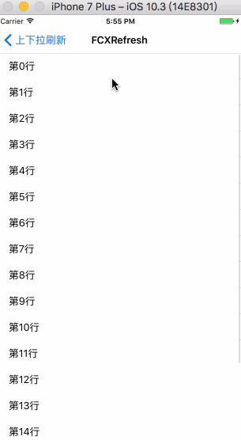

# FCXRefresh


常用的上下拉刷新功能都支持可自定义，只需简单的两三行代码即可完成，主要支持以下功能：

- [x] 普通上下拉刷新
- [x] 自动下拉刷新
- [x] 上拉无更多数据控制
- [x] 上下拉百分比显示
- [x] 自定义上下拉动画
- [x] 上拉底部间距控制


## 环境

- Xcode 11+
- iOS 8.0+

## 如何导入

### CocoaPods

```ruby
pod 'FCXRefresh'
```

### Carthage

```ogdl
github "FCXPods/FCXRefresh"
```

### 手动导入

把FCXRefresh文件夹导入即可

## 如何使用

### 包含头文件

```objc
#import "UIScrollView+FCXRefresh.h"
```

### 添加上下拉刷新

```objc
//下拉刷新
_refreshHeaderView = [self.tableView addHeaderWithRefreshHandler:^(FCXRefreshBaseView *refreshView) {
    [weakSelf refreshAction];
}];

//上拉加载更多
_refreshFooterView = [self.tableView addFooterWithRefreshHandler:^(FCXRefreshBaseView *refreshView) {
    [weakSelf loadMoreAction];
}];
```

### 刷新自定义设置

```objc
//自动下拉刷新
[_refreshHeaderView autoRefresh];

//自动上拉加载更多
_refreshFooterView.autoLoadMore = YES;

//上拉底部间距设置
_refreshFooterView.loadMoreBottomExtraSpace = 30;
```

### 上下拉百分比显示

```objc
_refreshHeaderView.pullingPercentHandler = ^(CGFloat pullingPercent) {
    headerPercentLabel.text = [NSString stringWithFormat:@"%.2f%%", pullingPercent * 100];
};

_refreshFooterView.pullingPercentHandler = ^(CGFloat pullingPercent) {
    footerPercentLabel.text = [NSString stringWithFormat:@"%.2f%%", pullingPercent * 100];
};
```

## 显示效果：




